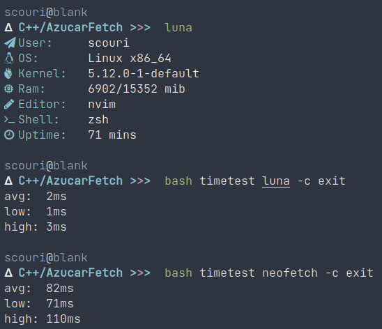

# luna

# usage
luna is written in c++, so you should compile it with gcc or another compiler, or you can use the makefile too.
It provides the main important information of your system, along with unicode icons to make it look better. There are no options for luna, just run luna and you get your system information, fast and simple.
